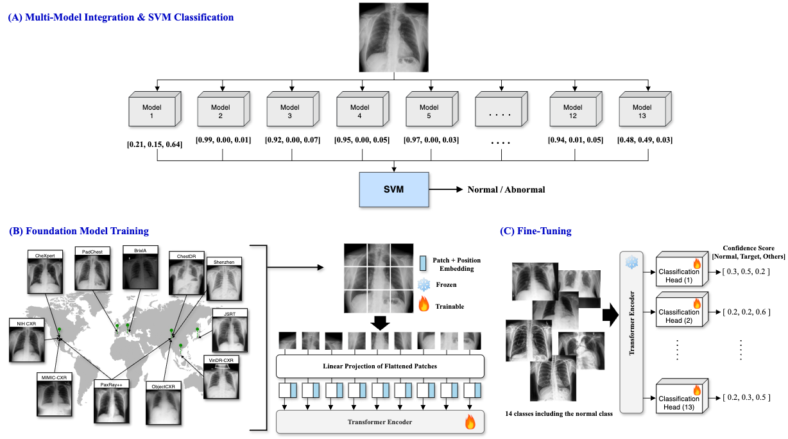

# FM-Normal-Triage

Normal chest X-ray triage model for fast normal/abnormal screening in clinical radiology workflows, built on a self-supervised DINOv2-based Foundation Model (FM).

## Overview

FM-Normal-Triage uses a DINOv2 backbone pre-trained via self-supervised learning on chest X-ray data, followed by:
1. **FM Downstream Training** — linear classification heads fine-tuned per augmentation/fold
2. **SVM Training** — an SVM ensemble trained on concatenated softmax probabilities from multiple linear heads
3. **SVM Inference** — binary (Normal / Abnormal) prediction with AUC, sensitivity, and specificity metrics



---

## Repository Structure

```
FM-Normal-Triage/
├── self-supervised-learning/
│   ├── dinov2/                         # FM downstream training (DINOv2-based)
│   │   ├── cls_train_srpark_1024.sh    # Training launch script (example)
│   │   ├── dinov2/
│   │   │   ├── run/eval/linear_1024.py # Training entry point
│   │   │   ├── eval/linear_1024.py     # Linear classifier training logic
│   │   │   ├── data/
│   │   │   │   ├── datasets/public_data.py  # Dataset classes (add new tasks here)
│   │   │   │   ├── loaders.py               # DataLoader & sampler configuration
│   │   │   │   └── samplers.py              # Custom samplers
│   │   │   └── ...
│   └── inference/                      # SVM training & inference
│       ├── fm_svm_train.py             # SVM training code
│       ├── fm_svm_train.sh             # SVM training launch script
│       ├── fm_svm_infer4.py            # SVM inference code
│       ├── fm_svm_infer4.sh            # SVM inference launch script
│       ├── configs/                    # Model config files
│       ├── data/                       # Dataset utilities
│       ├── layers/                     # Model layer definitions
│       ├── model_utils.py
│       └── setup.py
```

---

## Environment Setup

### 1. Docker

Build and run the Docker environment using the provided Dockerfile:

```bash
# Edit docker-compose-gpu.yaml to set:
#   - GPU device number
#   - Data mount paths
#   - .env file variables
docker compose -f docker-compose-gpu.yaml up -d
```

### 2. Conda Environment

Inside the container, set up the Conda environment:

```bash
# Create environment (takes ~40 minutes)
conda env create -f ./dinov2/new_conda_h100.yaml

# If git errors occur during creation:
conda install git
# Then re-run the above

# Initialize conda and re-enter the container
conda init bash
# Exit and re-enter the Docker container, then:
conda activate <env_name>

# Downgrade numpy for compatibility
pip install --force-reinstall -v "numpy==1.25.2"
```

> **Note:** If Conda is not installed, install Miniconda first before running the above.

---

## FM Downstream Training

The downstream training fine-tunes linear classification heads on top of the frozen DINOv2 backbone.

### Training Script

Reference script: `self-supervised-learning/dinov2/cls_train_srpark_1024.sh`

```bash
export PYTHONPATH="${PYTHONPATH}:."
python dinov2/run/eval/linear_1024.py \
    --config-file <PATH_TO_CONFIG>/config_to_1K.yaml \
    --pretrained-weights <PATH_TO_BACKBONE>/teacher_checkpoint.pth \
    --output-dir <OUTPUT_DIR> \
    --train-dataset normal-triage:root=<TRAIN_DATA_PATH> \
    --val-dataset   normal-triage:root=<VAL_DATA_PATH> \
    --test-datasets normal-triage:root=<TEST_DATA_PATH>
```

| Argument | Description |
|---|---|
| `--config-file` | DINOv2 config YAML (backbone architecture / resolution) |
| `--pretrained-weights` | Path to pre-trained FM backbone checkpoint |
| `--output-dir` | Directory to save linear head checkpoints |
| `--train-dataset` | Dataset string with root path |
| `--val-dataset` | Validation dataset path |
| `--test-datasets` | Test dataset path (can be same as val for most runs) |

> The test set is only used in the final iteration to produce evaluation metrics. It is safe to pass the same path as `--val-dataset` during intermediate runs.

### Customizing for a New Task

#### Classification

Edit `dinov2/eval/linear_1024.py`:

- `argparser` — modify learning rates (`--learning-rates` accepts a list; multiple values trigger grid search)
- `class LinearClassifier` — modify the FC layer for the target number of classes
- Augmentation — modify `srpark_make_classification_{train/eval}_1K_transform`
- Metrics — add or modify metrics using `torchmetrics`

#### Regression

Refer to `dinov2/eval/linear_reg.py` (Age regression reference):

- Modify `metrics.py` to add R², MAE, or other regression metrics
- Change loss at line ~365 (L1, MSE, etc.)

#### Segmentation / Detection

- Segmentation: see `notebooks/semantic_segmentation.ipynb`
- Detection: follow the Classification pattern

### Adding a New Dataset

1. **Dataset class** — add a new class in `dinov2/data/datasets/public_data.py`
2. **Loaders** — register the dataset string and sampler in `dinov2/data/loaders.py`
3. **Training script** — update `--train-dataset` / `--val-dataset` strings accordingly

#### Available Samplers

`DISTRIBUTED`, `EPOCH`, `INFINITE`, `SHARDED_INFINITE`, `SHARDED_INFINITE_NEW`, `GELEE_TORCH` (WeightedRandomShardedSampler)

To add a new sampler, implement it in `dinov2/data/samplers.py` and register it with an `elif` block in `loaders.py::_make_sampler`.

---

## SVM Training

The SVM is trained on concatenated softmax probability vectors from multiple fine-tuned linear heads.

### How It Works

1. Load the FM backbone + K linear heads (one per fold/augmentation)
2. Run forward pass over the training set → extract `(B, K×3)` probability features
3. Train an SVM (LinearSVC or RBF-SVC) on the extracted features

### Training Script

Reference: `self-supervised-learning/inference/fm_svm_train.sh`

```bash
python fm_svm_train.py \
  --config-file     <PATH_TO_CONFIG>/config.yaml \
  --pretrained-weights <PATH_TO_BACKBONE>/teacher_checkpoint.pth \
  --pretrained-linear-list "<LINEAR_HEAD_CKPT_1>,<LINEAR_HEAD_CKPT_2>,...,<LINEAR_HEAD_CKPT_K>" \
  --train-dataset   normal-triage:root=<TRAIN_DATA_PATH> \
  --batch-size      1 \
  --training-num-classes 3 \
  --svm-type        rbf \
  --C               1.0 \
  --svm-out         <OUTPUT_DIR>/svm_weight.pickle
```

| Argument | Description |
|---|---|
| `--pretrained-linear-list` | Comma-separated list of linear head checkpoint paths (order must be preserved) |
| `--pretrained-linear-glob` | Alternatively, a glob pattern for checkpoint paths |
| `--train-dataset` | Dataset string with root path |
| `--svm-type` | `linear` (LinearSVC) or `rbf` (RBF SVC) |
| `--C` | SVM regularization parameter |
| `--svm-out` | Output path for the trained SVM (`.pickle`) |
| `--training-num-classes` | Number of classes in the linear head (default: 3) |
| `--require-exact-num-models` | Safety check: exact number of linear heads expected (default: 13) |

**Outputs:**
- `<svm-out>` — trained SVM model (pickle)
- `train_features.npy` — extracted feature matrix
- `train_labels_binary.npy` — binary labels (0=Normal, 1=Abnormal)

---

## SVM Inference

### How It Works

1. Load FM backbone + K linear heads
2. Extract probability features for the test set
3. Load the pre-trained SVM and run prediction
4. Apply a decision score threshold (default: 0.29)
5. Output per-sample CSV, ROC curve data, AUC, sensitivity, specificity, NPV, etc.

### Inference Script

Reference: `self-supervised-learning/inference/fm_svm_infer4.sh`

```bash
python fm_svm_infer4.py \
  --config-file     <PATH_TO_CONFIG>/config.yaml \
  --pretrained-weights <PATH_TO_BACKBONE>/teacher_checkpoint.pth \
  --pretrained-linear-list "<LINEAR_HEAD_CKPT_1>,<LINEAR_HEAD_CKPT_2>,...,<LINEAR_HEAD_CKPT_K>" \
  --test-dataset    normal-triage:root=<TEST_DATA_PATH> \
  --batch-size      1 \
  --training-num-classes 3 \
  --svm-model-path  <PATH_TO_SVM>/svm_weight.pickle \
  --outdir          <OUTPUT_DIR>
```

| Argument | Description |
|---|---|
| `--svm-model-path` | Path to trained SVM pickle produced by `fm_svm_train.py` |
| `--test-dataset` | Dataset string with root path |
| `--outdir` | Directory for output files |
| `--save-features` | Save extracted features (default: True) |
| `--save-preds` | Save raw SVM predictions (default: True) |

**Outputs (in `--outdir`):**
| File | Description |
|---|---|
| `detailed_results.csv` | Per-sample predictions, probabilities, decision scores |
| `per_sample_binary_030.csv` | Simplified per-sample binary prediction |
| `roc_curve_data.csv` | FPR / TPR / threshold for ROC curve |
| `features.npy` | Extracted feature matrix |
| `labels_binary.npy` | Ground-truth binary labels |
| `svm_preds.npy` | Raw SVM predictions |
| `FP.txt` | File paths of false positives |
| `FN.txt` | File paths of false negatives |

**Metrics printed to stdout:** Accuracy, PPV, Precision, Sensitivity, Specificity, NPV, AUC

---

## Notes

- The FM backbone expects **1024×1024** input images.
- Labels are mapped to binary (0 = Normal, 1 = Abnormal) based on folder names: folders named `normal` map to 0; folders named `target` or `others` map to 1.
- The decision threshold in `fm_svm_infer4.py` is set to `0.29` by default and can be adjusted in the script.
- To use a different backbone, update `--config-file` and `--pretrained-weights` accordingly.

---

## License

See [LICENSE](LICENSE) for details.
